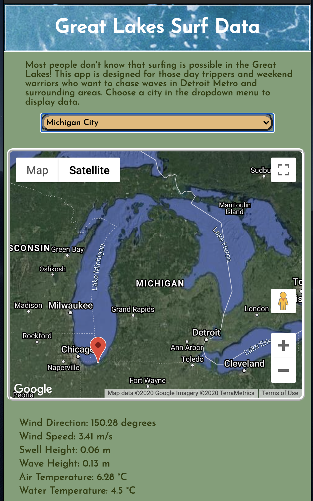

# GREAT LAKES SURF DATA

Can you surf in Michigan!? Surprisingly yes!...This app was built in mind for those Michigander day trippers and weekend warriors who want to chase the Great Lakes Surf with informative data. Choose a local city in the Michigan Area (dropdown menu), and get back weather, wave, and location data.
[surf api](https://derek-arrotta.github.io/surf-api/)

## Technology

* Languages: HTML, CSS, JavaScript, and jQuery
* APIs: 
  * [Google Maps JavaScript](https://developers.google.com/maps/documentation/javascript/overview?utm_source=google&utm_medium=cpc&utm_campaign=FY18-Q2-global-demandgen-paidsearchonnetworkhouseads-cs-maps_contactsal_saf&utm_content=text-ad-none-none-DEV_c-CRE_359194145415-ADGP_Hybrid%20%7C%20AW%20SEM%20%7C%20BKWS%20~%20Google%20Maps%20Javascript%20API-KWID_43700045479855436-kwd-341556983684-userloc_9016823&utm_term=KW_%2Bmaps%20%2Bjavascript%20%2Bapi-ST_%2Bmaps%20%2Bjavascript%20%2Bapi&gclid=CjwKCAiArIH_BRB2EiwALfbH1MRIFdzqFbaxqqDHjhMsA78Yr7EWSd8P-HND1aDmqwZVHKMzDc4KahoCmPIQAvD_BwE)
  * [Storm Glass](https://stormglass.io/)

## Lessons Learned

I learned a lot about scope in this project, and what it means to really execute on ideas. It can take a couple hours to come up with awesome ideas and a vision, but much longer to implement that grand vision. My MVP ended up being much smaller and humbler than I had orginally envisioned. 

## Screenshots

### Intro

